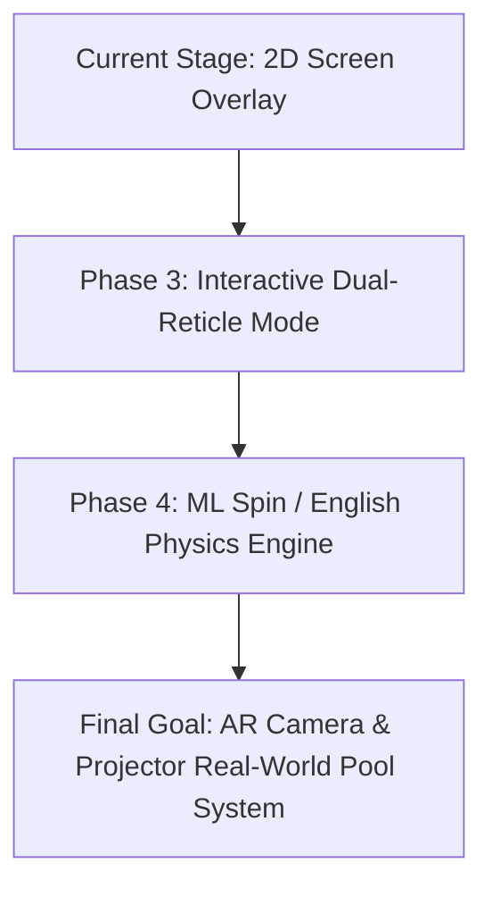

# Mock Pool AI Guideline Overlay & Trajectory Engine

A real-time, hardware-accelerated computer vision and physics trajectory projection overlay for **Mock Pool**.

```
+-------------------------------------------------------------------------+
|                                                                         |
|                          [ Active Mock Pool Game ]                      |
|                                                                         |
|     (Cue Stick) =======> (Cue Ball) --------> (Target Ball)             |
|                                                      \                  |
|                                                       \ (Bank Ray 1)    |
|                                                        \                |
|                                                    [ Cushion ]          |
|                                                        /                |
|                                                       / (Bank Ray 2)    |
|                                                      v                  |
|                                                  ( Pocket )             |
|                                                                         |
+-------------------------------------------------------------------------+
```

---

## 📌 Project Overview

This project is an **Android System Overlay & Computer Vision Assistant** designed to calculate and project laser-accurate pool shot trajectories in real time over **Mock Pool**.

By acquiring frames via `MediaProjection` and processing them at **60 FPS** using sub-pixel collinear raycasting and high-speed vector physics, the overlay predicts:
- **Extended Primary Aim Line**: Direct path from the Cue Ball to the Target Ball.
- **Ghost Ball Positioning**: The exact point of contact on the target ball.
- **Multi-Cushion Bank Reflections**: Up to 4 cushion bounces with geometric specular reflection and cushion elasticity.
- **90-Degree Tangent Cue Deflection**: Cue ball separation path post-impact for position play.
- **Pocket Alignment Scoring**: Live detection of high-probability pocket entry angles.

---

## 📍 Current Stage of Development

### ✅ Completed Milestones (Current Stage: Phase 2 Complete)
1. **Real-Time 60 FPS Capture Pipeline**:
   - Integrated Android 14+ / API 35 `MediaProjection` foreground service with non-blocking coroutine frame dispatch.
   - Sub-3ms processing per frame with trigonometric lookup tables (LUTs) and bitwise color operations.
2. **Cue-Anchored Collinear Aiming Engine**:
   - Solves the true aim vector by anchoring directly to the detected Cue Ball.
   - Eliminates false detections caused by table logos, decals, and stationary ball rows across the felt.
3. **Multi-Cushion Physics & Deflection**:
   - Accurate 4-rail cushion bank raycasting into pockets.
   - Tangent cue ball deflection calculation on cut shots.
4. **Hardware-Accelerated Overlay View**:
   - `OverlayCanvasView` running with `FLAG_HARDWARE_ACCELERATED`, custom smoothing filters (EMA $\alpha = 0.35$), and live FPS counter.
5. **On-Device AI / TFLite Architecture Ready**:
   - TensorFlow Lite neural detector integration pipeline ready for anchor-based deep object detection.

---

## 🎯 Final Goal & Future Roadmap



### 1. Interactive Dual-Reticle Precision Mode (Phase 3)
- Introduce transparent, draggable touch handles on the overlay for instant manual adjustment and auto-snapping to the nearest ball.

### 2. English & Spin Physics Simulation (Phase 4)
- Incorporate topspin (follow), backspin (draw), and side spin (english) trajectory curvature equations onto the projected rays.

### 3. Real-World AR Pool Assistant (Final Goal)
- Transition the computer vision and physics algorithms from mobile screen capture to an **external camera + ceiling projector / AR glasses** setup, projecting guideline trajectories directly onto physical real-world pool tables.

---

## 🏗️ Architecture & Component Breakdown

| Module | Location | Purpose |
| :--- | :--- | :--- |
| **CV Detection Engine** | `com.pool.guideline.overlay.cv.TableAndBallDetector` | Cue-anchored collinear line solver and felt boundary detection. |
| **Physics Raycaster** | `com.pool.guideline.overlay.physics.TrajectoryPhysicsEngine` | Multi-cushion bank bounces, pocket scoring, and tangent deflection. |
| **AI Neural Pipeline** | `com.pool.guideline.overlay.ai.TFLitePoolDetector` | On-device TensorFlow Lite object detection pipeline. |
| **Capture Service** | `com.pool.guideline.overlay.service.ScreenCaptureManager` | 60 FPS Android `MediaProjection` frame acquisition. |
| **Foreground Service** | `com.pool.guideline.overlay.service.OverlayService` | Manages floating system overlay window and background lifecycle. |
| **Overlay Renderer** | `com.pool.guideline.overlay.ui.OverlayCanvasView` | Hardware-accelerated drawing canvas with EMA smoothing. |

---

## 🛠️ Building & Running Locally

### Prerequisites
- **Android SDK**: API 35 (`compileSdk = 35`, `minSdk = 26`)
- **JDK**: Java 17
- **Gradle**: 8.5+

### Build Steps:
```powershell
# Set environment variables
$env:JAVA_HOME = "C:\path\to\jdk-17"
$env:ANDROID_HOME = "C:\path\to\android-sdk"
$env:PATH = "$env:JAVA_HOME\bin;$env:PATH"

# Assemble Debug APK
.\gradlew.bat assembleDebug

# Copy output APK
Copy-Item "app\build\outputs\apk\debug\app-debug.apk" -Destination "PoolGuidelineOverlay-v1.0.apk" -Force
```

---

## 📦 Direct APK Download
- Pre-built debug APK: `PoolGuidelineOverlay-v1.0.apk` (committed directly to the repository root).
