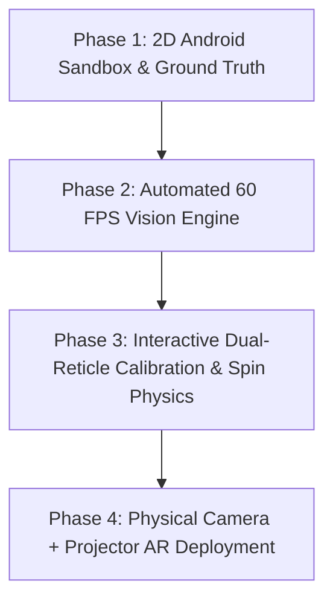

# Mock Pool AI Guideline & AR Projection System

An end-to-end Computer Vision, Trajectory Physics, and Augmented Reality Projection System designed to calculate and project laser-accurate pool shot guidelines.

```
=========================================================================================
                                  PROJECT ROADMAP & ARCHITECTURE
=========================================================================================

[ PHASE 1 & 2: Digital Sandbox & Android Overlay (Current) ]
+---------------------------------------------------------------------------------------+
|  Mock Pool Game (Screen) ---> Real-Time Screen Capture (60 FPS)                      |
|                                         |                                             |
|                                         v                                             |
|                         [ CV / Collinear Raycast Engine ]                             |
|                                         |                                             |
|                                         v                                             |
|                         [ Vector Physics Engine (4 Bounces) ]                         |
|                                         |                                             |
|                                         v                                             |
|                       [ Transparent 60 FPS Android Overlay ]                          |
+---------------------------------------------------------------------------------------+
                                          |
                                          v
[ PHASE 3 & 4: Physical Hardware AR Projection (Final Target) ]
+---------------------------------------------------------------------------------------+
|                                                                                       |
|                                 [ Overhead 4K Camera ]                                |
|                                           |                                           |
|                                    (Live RTSP/USB)                                    |
|                                           v                                           |
|    Physical Table Felt =======> [ Edge AI Vision Engine ] ====> [ Projector Output ]  |
|                                                                         |             |
|                                                                         v             |
|                                                (Laser Trajectory on Physical Table)   |
|                                                                                       |
+---------------------------------------------------------------------------------------+
```

---

## 🎯 Master Goal & Project Vision

The ultimate goal of this project is to build a **Real-World AR Pool Assistant** using an overhead camera and ceiling-mounted projector:
1. **Camera Input**: A camera mounted above a physical pool table tracks the real cue stick, cue ball, and object balls in real time.
2. **Physics Engine**: Calculates direct aim lines, ghost ball contact points, cushion bank reflections (up to 4 rails), and pocket entry paths.
3. **Projector Output**: A projector casts the calculated laser guidelines directly onto the physical table felt so players can visualize any bank shot live.

---

## 🛠️ Step-by-Step Execution Strategy

To ensure the system is **100% foolproof** before deploying physical hardware, development is divided into 4 sequential phases:



### 📍 Phase 1: 2D Sandbox & Ground Truth Verification (Complete)
- **Goal**: Create an interactive 2D table environment on Android to test collision mathematics and geometric bank reflections against known ground truth.
- **Verification**: Ensure multi-cushion bank bounces obey specular reflection laws (\(\theta_{\text{incident}} = \theta_{\text{reflected}}\)) and cushion compression elasticity.

### 📍 Phase 2: High-Speed Android Overlay & Vision Pipeline (Current Stage)
- **Goal**: Build an Android System Overlay that runs on top of the 2D Mock Pool game at **60 FPS**.
- **Key Modules**:
  - `MediaProjection` non-blocking frame acquisition.
  - Sub-pixel collinear line detector anchored to the Cue Ball.
  - Hardware-accelerated `OverlayCanvasView` with Exponential Moving Average (EMA) trajectory smoothing.

### 📍 Phase 3: Interactive Dual-Reticle Calibration & Spin Physics (Next Step)
- **Goal**: Add manual interactive touch handles (Cue Reticle + Aim Reticle) with auto-snap capabilities to allow instant manual verification under any table conditions.
- **Physics Expansion**: Add topspin (follow), backspin (draw), and side english cushion deflection models.

### 📍 Phase 4: Overhead Camera + Projector Real-World Hardware (Final Target)
- **Goal**: Port the verified detection and physics engine to an Android-based Edge device or mini-PC connected to:
  1. **Overhead Camera**: Using OpenCV homography calibration (`findHomography` / `warpPerspective`) to eliminate lens distortion.
  2. **Ceiling Projector**: Projecting trajectory vectors directly onto physical felt with sub-millimeter precision.

---

## 🏗️ Architecture & Component Reference

| Module | File Location | Responsibility |
| :--- | :--- | :--- |
| **Collinear Vision Solver** | [`TableAndBallDetector.kt`](file:///c:/Users/Gaming%20Krew/Documents/antigravity/optimistic-meitner/app/src/main/java/com/pool/guideline/overlay/cv/TableAndBallDetector.kt) | Extracts active guideline dots and isolates cue ball vs target ball. |
| **Physics Raycaster** | [`TrajectoryPhysicsEngine.kt`](file:///c:/Users/Gaming%20Krew/Documents/antigravity/optimistic-meitner/app/src/main/java/com/pool/guideline/overlay/physics/TrajectoryPhysicsEngine.kt) | Calculates ghost ball contact, 4-rail cushion bounces, and pocket scores. |
| **On-Device AI Engine** | [`TFLitePoolDetector.kt`](file:///c:/Users/Gaming%20Krew/Documents/antigravity/optimistic-meitner/app/src/main/java/com/pool/guideline/overlay/ai/TFLitePoolDetector.kt) | TensorFlow Lite spatial feature detector for robust ball classification. |
| **Screen Capture Service** | [`ScreenCaptureManager.kt`](file:///c:/Users/Gaming%20Krew/Documents/antigravity/optimistic-meitner/app/src/main/java/com/pool/guideline/overlay/service/ScreenCaptureManager.kt) | High-speed 60 FPS Android `MediaProjection` capture manager. |
| **Floating System Overlay** | [`OverlayService.kt`](file:///c:/Users/Gaming%20Krew/Documents/antigravity/optimistic-meitner/app/src/main/java/com/pool/guideline/overlay/service/OverlayService.kt) | Manages background foreground service lifecycle and floating view window. |
| **Canvas Renderer** | [`OverlayCanvasView.kt`](file:///c:/Users/Gaming%20Krew/Documents/antigravity/optimistic-meitner/app/src/main/java/com/pool/guideline/overlay/ui/OverlayCanvasView.kt) | Hardware-accelerated drawing canvas with jitter suppression. |

---

## 🧪 How to Verify Guidelines on Android

1. **Direct Aim Line Verification**:
   - Aim directly at a corner pocket.
   - Verify that the extended solid line passes through the object ball center and connects directly into the pocket center.
2. **Cut Shot & Ghost Ball Verification**:
   - Aim at a 30° cut shot.
   - Verify that the ghost ball ring is rendered at the exact tangent contact point and the target ball trajectory departs along the normal vector.
3. **Multi-Cushion Bank Verification**:
   - Aim at a cushion rail.
   - Verify that the dotted reflection lines bounce off each cushion rail with symmetric reflection angles.

---

## 🚀 Building the Project

```powershell
# Set JDK 17 and Android SDK
$env:JAVA_HOME = "C:\path\to\jdk-17"
$env:ANDROID_HOME = "C:\path\to\android-sdk"
$env:PATH = "$env:JAVA_HOME\bin;$env:PATH"

# Build APK locally
.\gradlew.bat assembleDebug
```

- **Output APK**: `PoolGuidelineOverlay-v1.0.apk`
